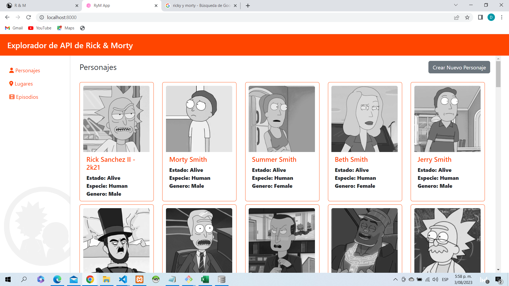
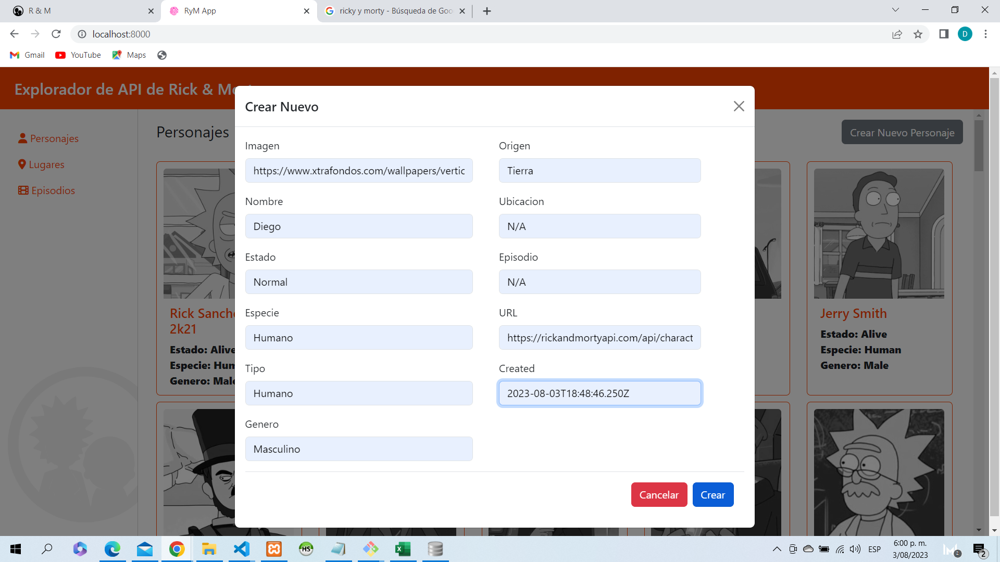
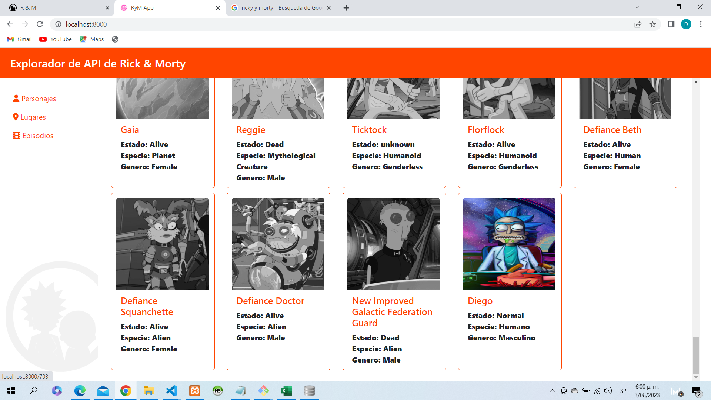
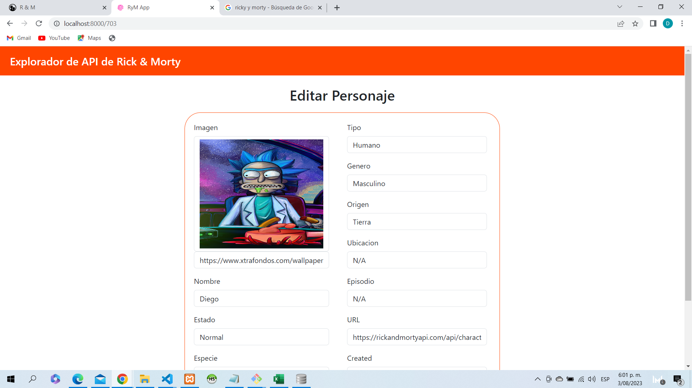
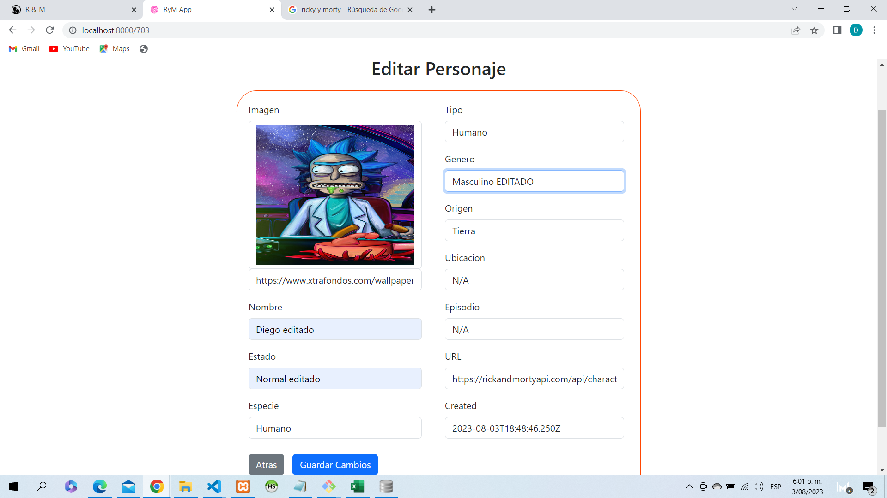

## Aplicacion Ricky and Morty en Laravel

Aplicacion desarrollada con el framework de Laravel (PHP) apoyada con Bootstrap y Fontawesome, donde se agrega ejemplos de usabilidad, navegación, consulta y gestión CRUD para los personajes de la misma.

Pasos para tener en cuenta:

- Tener instalado composer.
- Git clone rym_app_laravel.
- Abre la terminal de preferencia y ubicate en la carpeta donde deseas clonar el repositorio.
- Digita git clone y pega la url que copiaste anteriormente, luego presiona ENTER.

EJECUCION:

- En la terminar corre composer install.
- Luego corre php artisan serve para levantar el servidor.

## Capturas

## Autor

Diego Fernando Mendez Vargas

## Ultima actualizacion

03 de Agosto de 2023